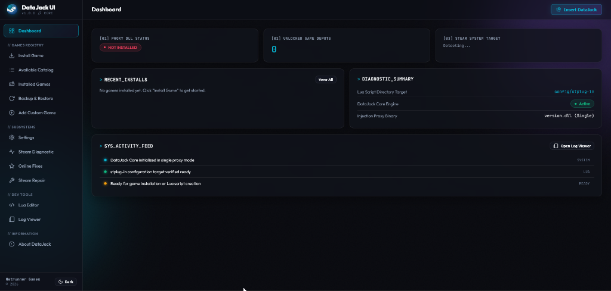

  
  <h1>DataJackUI</h1>
  
Native Windows C++ Lua & Manifest management utility for Steam.

   
  

---

## 🚀 Releases & Downloads

Pre-built binaries and silent installers are compiled directly from source and published on the [**Releases**](https://github.com/ExpectedNinja/DataJackUI/releases) page.

### Available Downloads:
- ⚡ **`DataJack-win-Setup.exe`**: Velopack Silent Installer *(Recommended — Installs to `%LOCALAPPDATA%\DataJack` with shortcuts)*.
- 📦 **`DataJack-win-Portable.zip`**: Portable Release Package *(No installation required — extract and run anywhere)*.
- 🔑 **`version.dll`**: 64-bit Steam proxy binary payload.

---

## ✨ Features
- **Windows 11 Native Mica Backdrop**: Immersive translucent dark glass UI.
- **Zero-Disk Memory Architecture**: Sub-100MB RAM footprint using in-memory web resource streaming.
- **Steam Library Scanner**: Automatically parses installed game manifests.
- **Real-Time Diagnostics**: Live logging and script management.

---

## 📜 License

Copyright (c) 2026 Netrunner Games. All rights reserved.  
See [LICENSE](LICENSE) for proprietary usage terms.
